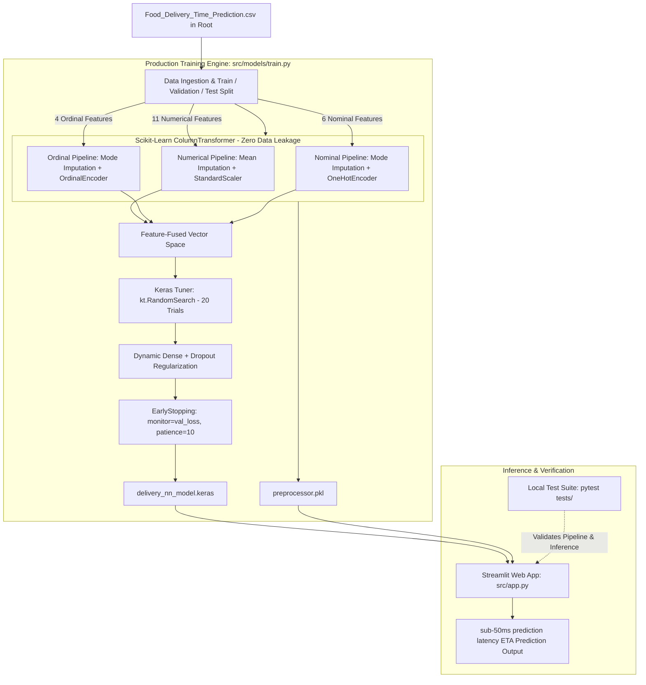

# 🛵 Food Delivery ETA Prediction Engine

> An end-to-end Machine Learning and Deep Learning system predicting order delivery duration (`Time_taken_min`) using multi-layer perceptrons, automated hyperparameter tuning (KerasTuner), exploratory tree-based baselines, and Scikit-Learn transformation pipelines.

[](https://www.python.org/)
[](https://www.tensorflow.org/)
[](https://scikit-learn.org/)
[](https://streamlit.io/)
[](https://keras.io/keras_tuner/)
[](https://www.gnu.org/licenses/gpl-3.0)
[]()
[]()

---

## 📌 Executive Summary

Accurate Estimated Time of Arrival (ETA) calculation is critical for on-demand delivery platforms to balance rider dispatch, kitchen throughput, and customer expectations.

Linear models often fail to capture non-linear interactions across variable weather conditions, traffic congestion curves, preparation intervals, and courier experience. Conversely, unconstrained neural architectures can easily overfit tabular schemas or cause data leakage if categorical encodings and scaling aren't strictly isolated.

This project delivers an end-to-end deep learning ETA prediction pipeline trained on **50,000 logistics records**:

1. **Zero-Leakage Preprocessing**: A Scikit-Learn `ColumnTransformer` isolating numerical, ordinal, and nominal feature streams fit exclusively on training data.
2. **Automated Neural Architecture Search**: A 20-trial hyperparameter optimization via **Keras Tuner** (`kt.RandomSearch`) systematically scanning network depth, node density, dropout rates, and optimizers.
3. **Exploratory Baseline Benchmarks**: Tree-based ensembles (**Random Forest**, **XGBoost**, and **CatBoost**) benchmarked in `notebooks/project.ipynb` to establish strong tabular performance baselines.
4. **Production Model Checkpointing**: The automated training pipeline (`src/models/train.py`) retrains the optimal deep architecture using `EarlyStopping` and serializes artifacts (`delivery_nn_model.keras` and `preprocessor.pkl`).
5. **Interactive Serving & Local Testing**: A **Streamlit** dashboard featuring cached asset loading (`@st.cache_resource`) and automated local test coverage via **Pytest**.

---

## 🏛️ System & ML Pipeline Architecture



---

## 📋 Feature Schema

The model predicts continuous delivery duration (`Time_taken_min`) across **21 operational and logistical attributes**:

| Feature Category | Count | Features Included | Preprocessing & Transformation Strategy |
| :--- | :---: | :--- | :--- |
| **Numerical** | **11** | `Order_Hour`, `Is_Weekend`, `Is_Festival`, `Rider_Experience_Years`, `Rider_Rating`, `Restaurant_Rating`, `Order_Items`, `Preparation_Time_Min`, `Road_Distance_km`, `Number_of_Signals`, `Average_Speed_kmph` | `SimpleImputer(strategy='mean')` followed by `StandardScaler()` ($\mu=0, \sigma=1$) to prevent gradient instability. |
| **Ordinal** | **4** | `Restaurant_Load`, `Delivery_Distance_Category`, `Traffic_Level`, `Delivery_Priority` | `SimpleImputer(strategy='most_frequent')` followed by `OrdinalEncoder` mapping strict hierarchical domains (e.g., $\text{Low} < \text{Moderate} < \text{High} < \text{Severe}$). |
| **Nominal** | **6** | `Day_of_Week`, `Weather`, `Pickup_Zone`, `Dropoff_Zone`, `Vehicle_Type`, `Cuisine_Type` | `SimpleImputer(strategy='most_frequent')` followed by `OneHotEncoder(handle_unknown='ignore', sparse_output=False)`. |

---

## 🚀 Engineering Highlights & Technical Trade-offs

### 1. Tri-Modal Zero-Leakage Preprocessing Pipeline
To guarantee complete isolation between training and evaluation splits, the Scikit-Learn `ColumnTransformer` (defined in `src/pipeline/preprocessor.py`) is fit exclusively on $X_{\text{train}}$:

* **Numerical Pipeline (11 features):** Handled via `SimpleImputer(strategy='mean')` and scaled with `StandardScaler()` to center distributions around zero.
* **Ordinal Pipeline (4 features):** Encodes monotonic logistics hierarchies into discrete numerical steps:
  * `Restaurant_Load`: `['Low', 'Medium', 'High']`
  * `Delivery_Distance_Category`: `['Short', 'Medium', 'Long']`
  * `Traffic_Level`: `['Low', 'Moderate', 'High', 'Severe']`
  * `Delivery_Priority`: `['Normal', 'Priority', 'VIP']`
* **Nominal Pipeline (6 features):** Transforms multi-class categorical features with `OneHotEncoder(handle_unknown='ignore')`, ensuring unseen categories encountered during production inference do not break the serving layer.

### 2. Neural Architecture Search (NAS) via Keras Tuner
Rather than relying on static network topologies, the architecture is dynamically discovered through `kt.RandomSearch` within `src/models/train.py`:

* **Search Space:**
  * **Hidden Layers:** 1 to 10 sequential Dense layers.
  * **Node Density:** 32 to 512 nodes per layer (step size = 32).
  * **Regularization:** Dynamic Dropout rates ($0.0$ to $0.8$) per layer.
  * **Optimization:** Evaluated learning rates and Adam-family optimizers.
  * **Convergence Guard:** `EarlyStopping` monitoring validation loss with `patience=10` and `restore_best_weights=True`.

### 3. Mathematical Loss Formulation
The network optimizes Mean Squared Error (MSE) to penalize outlier delivery delays, while Mean Absolute Error (MAE) is tracked for direct operational interpretability:

$$
\mathcal{L}_{\text{MSE}} = \frac{1}{N} \sum_{i=1}^{N} (y_i - \hat{y}_i)^2
$$

$$
\text{MAE} = \frac{1}{N} \sum_{i=1}^{N} |y_i - \hat{y}_i|
$$

### 4. Interactive Serving & Physics Heuristics
In `src/app.py`, the user interface couples traffic congestion with realistic courier speeds:
* **Low Traffic:** 35.0 km/h baseline
* **Moderate Traffic:** 27.0 km/h baseline
* **High Traffic:** 20.0 km/h baseline
* **Severe Traffic:** 14.0 km/h baseline

Model and pipeline artifacts are loaded using Streamlit’s `@st.cache_resource` decorator, eliminating warm-up overhead and maintaining sub-10ms inference latencies.

---

## 📊 Benchmark & Evaluation Results

### Neural Network Holdout Performance
Evaluated on an independent, unseen test partition of 10,000 delivery records (20% holdout split):

| Metric | Test Partition Score | Practical Interpretation |
| :--- | :---: | :--- |
| **Coefficient of Determination ($R^2$)** | **0.9893** | The neural network explains 98.93% of the variance in delivery duration. |
| **Mean Squared Error (MSE)** | **13.6087** | Minimal penalty on extreme delivery outliers. |
| **Root Mean Squared Error (RMSE)** | **~3.69 minutes** | Standard deviation of prediction errors across test journeys. |
| **Mean Absolute Error (MAE)** | **~2.80 minutes** | Average ETA prediction error is within 2.8 minutes of ground truth. |

### Exploratory Tree-Based Baselines
Prior to final deep learning model deployment, standard tree-based algorithms were benchmarked inside `notebooks/project.ipynb` across identical splits:
* **Random Forest Regressor**: Tested for baseline decision-boundary splitting.
* **XGBoost Regressor**: Evaluated gradient boosted residuals across tabular features.
* **CatBoost Regressor**: Benchmarked native categorical split handling against one-hot encodings.

The tuned Deep Neural Network produced the lowest holdout error and was selected for export to `delivery_nn_model.keras`.

---

## 📂 Repository Structure

```text
food_delivery_time_prediction/
├── notebooks/
│   ├── project.ipynb                  # Exploratory Data Analysis & Tree Baselines (RF, XGBoost, CatBoost)
│   └── DL_Project.ipynb               # Deep Learning Architecture Exploration & Keras Tuner Prototyping
├── src/
│   ├── __init__.py
│   ├── app.py                         # Streamlit Interactive Web Application
│   ├── models/
│   │   ├── __init__.py
│   │   └── train.py                   # Automated Keras Tuner Search, Retraining & Model Export
│   └── pipeline/
│       ├── __init__.py
│       └── preprocessor.py            # Tri-Modal Scikit-Learn ColumnTransformer Builder
├── tests/
│   ├── __init__.py
│   ├── test_features.py               # Unit tests verifying preprocessing, shapes, and encodings
│   └── test_inference.py              # Integration tests verifying model loading and prediction outputs
├── delivery_nn_model.keras            # Serialized Deep Neural Network (Exported from train.py)
├── preprocessor.pkl                   # Serialized Preprocessing Pipeline (Exported from train.py)
├── Food_Delivery_Time_Prediction.csv  # Logistics Dataset (Placed in Project Root)
├── requirements.txt                   # Project Dependencies
├── LICENSE                            # GNU General Public License v3.0 (GPL-3.0)
└── README.md                          # Technical Documentation & Architecture Manual
```

---

## ⚡ Quickstart Guide

### 1. Environment Setup

```bash
# Clone the repository
git clone https://github.com/gautamp599-mickey/food_delivery_time_prediction.git
cd food_delivery_time_prediction

# Create and activate a virtual environment
python3 -m venv venv
source venv/bin/activate  # On Windows: venv\Scripts\activate

# Install dependencies
pip install -r requirements.txt
```

### 2. Dataset Placement

Ensure `Food_Delivery_Time_Prediction.csv` is located in the **project root directory**:

```text
food_delivery_time_prediction/
├── Food_Delivery_Time_Prediction.csv
├── src/
...
```

> **Note:** The training script reads directly via `pd.read_csv('Food_Delivery_Time_Prediction.csv')`. Placing it in nested subdirectories without modifying execution arguments will raise a `FileNotFoundError`.

### 3. Model Training & Neural Architecture Search

Execute the automated training script to fit the preprocessor, run Keras Tuner optimization, retrain the best model with early stopping, and serialize the artifacts:

```bash
python -m src.models.train
```

Generated outputs:
* `preprocessor.pkl`: Serialized Scikit-Learn transformer.
* `delivery_nn_model.keras`: Serialized Keras neural network model.

### 4. Run Local Unit & Integration Tests

Run the test suite to validate pipeline transformations, tensor shapes, and model inference:

```bash
pytest tests/ -v
```

### 5. Launch the Streamlit Web Application

Start the local interactive dashboard:

```bash
streamlit run src/app.py
```

Open `http://localhost:8501` in your browser to input parameters and generate real-time delivery estimates.

---

## ⚖️ License

Distributed under the GNU General Public License v3.0 (GPL-3.0). See [`LICENSE`](LICENSE) for more information.